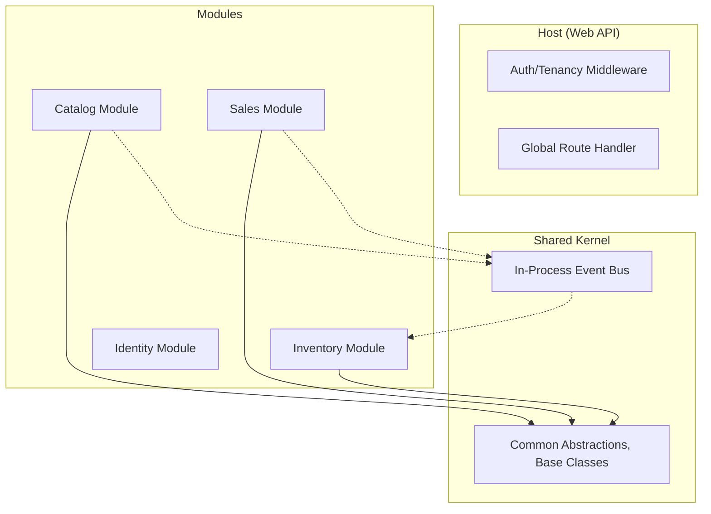

# Architectural Design Document: Retail POS (Modular Monolith)
**Version:** 1.0.0  
**Status:** Draft / Review  
**Target Platform:** .NET 9+, Cloud-Agnostic

## 1. Executive Summary
This document outlines the architecture for a cloud-agnostic, multi-tenant Retail Point of Sale (POS) system using a **Modular Monolith (Modulith)** pattern. This approach balances the simplicity of a single deployment unit with the scalability and decoupling of microservices.

---

## 2. Business Architecture
The system supports multiple retail tenants (stores/chains), each with their own catalog, inventory, and users.

### 2.1 Core Business Capabilities
- **Catalog Management**: Products, categories, attributes, pricing.
- **Inventory Management**: Stock levels, multi-location support, adjustments.
- **Sales & Checkout**: Transaction processing, discount engine, tax calculation.
- **Customer Management**: Profiles, loyalty points, purchase history.
- **Reporting & Analytics**: Sales trends, inventory turnover, tax reports.

### 2.2 Multi-Tenancy Strategy
- **Isolation Level**: Logical isolation using `TenantId` discriminator in a shared database (Shared Database, Shared Schema).
- **Tenant Context**: Injected via middleware based on `X-Tenant-Id` header or Subdomain.

---

## 3. Application Architecture (Modular Monolith)

### 3.1 Structural Design
The solution is divided into independent modules. Each module is a "Vertical Slice" containing its own Domain, Application, and Infrastructure layers.

### 3.2 Module Layout (Clean Architecture per Module)
- **Domain**: Entities, Value Objects, Domain Events, Repository Interfaces.
- **Application**: Commands, Queries (MediatR), DTOs, Mapping logic.
- **Infrastructure**: DB Context (per module), External service implementations.
- **API**: Controllers (opt-in) or Minimal API endpoints.

### 3.3 High-Level Component Diagram

---

## 4. Data Architecture
- **Primary Database**: PostgreSQL or SQL Server (via EF Core).
- **Migration Strategy**: Each module can manage its own schema migrations, but they are executed by the Host project.
- **Data Integrity**: Cross-module constraints are avoided at the DB level; consistency is managed via Domain Events.

---

## 5. Technology Architecture
- **Runtime**: .NET 9.0 SDK.
- **Persistence**: EF Core with Npgsql (PostgreSQL).
- **In-Process Pub/Sub**: MediatR.
- **Validation**: FluentValidation.
- **API Documentation**: Swagger/OpenAPI.
- **Observability**: OpenTelemetry + Serilog.

---

## 6. System Design (LLD)

### 6.1 In-Process Communication
Modules communicate asynchronously via an internal message bus (MediatR Notifications) to ensure loose coupling. synchronous calls are restricted to Shared Interfaces.

### 6.2 Out-Process Communication
The system is ready for "Cloud Agnostic" messaging (Azure Service Bus, AWS SNS/SQS, or RabbitMQ) via a generic abstraction layer if horizontal scaling beyond a single instance is required for specific modules in the future (Modular Monolith -> Microservices migration path).

---

## 7. SDLC Lifecycle
See `PROMPTS.md` for the automated generation of features across the SDLC stages.
