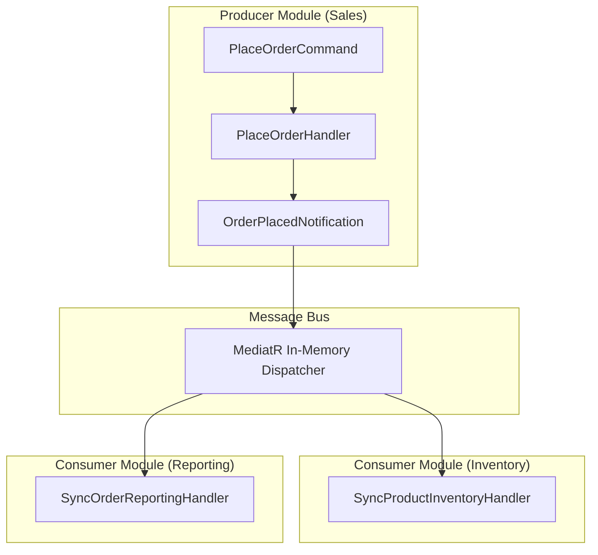
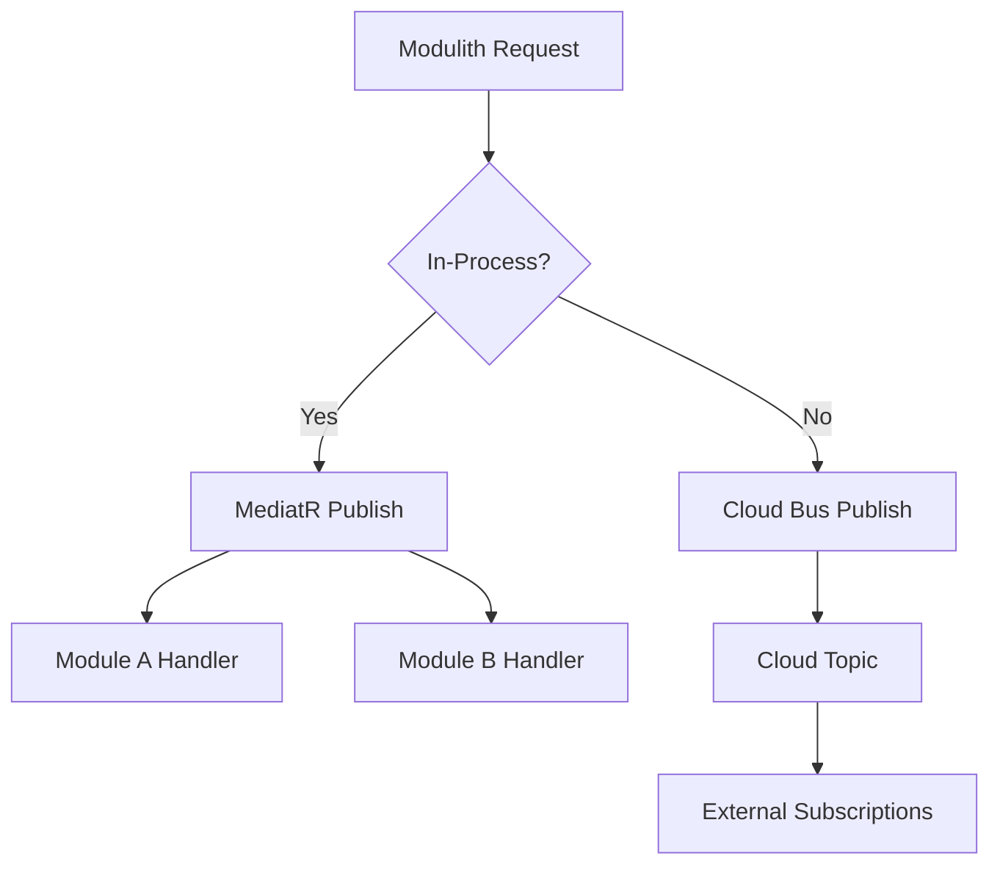

# Communication Flows: Retail POS (Modular Monolith)

## 1. In-Process Communication (Within Modulith)
In-process communication is decoupled via MediatR notifications.

### High-Level Flow (HLD: In-Process)


### Low-Level Flow (LLD: In-Process)
**Method signatures (C#):**
```csharp
// Publisher
public record OrderPlacedNotification(Guid OrderId, List<Guid> ProductIds) : INotification;

// Subscriber
public class SyncProductInventoryHandler : INotificationHandler<OrderPlacedNotification>
{
    private readonly IInventoryRepository _repo;
    public Task Handle(OrderPlacedNotification notification, CancellationToken ct) 
    {
        return _repo.DecrementStockAsync(notification.ProductIds);
    }
}
```

---

## 2. Out-Process Communication (Cloud-Agnostic)
Out-process communication is reserved for external consumers (e.g., mobile apps, third-party stock apps) or for future microservice extraction.

### High-Level Flow (HLD: Out-Process)
```mermaid
graph LR
    Modulith[Retail Modulith] --> Bus[Generic Cloud Bus]
    Bus --> Webhook[External Integrations]
    Bus --> MobileApp[Mobile App Push Service]
    Bus --> EmailService[SendGrid / SES]

    subgraph "Cloud Providers"
        Bus -.-> AzureServiceBus[Azure Service Bus]
        Bus -.-> AWS_SNS[AWS SNS/SQS]
    )
```

### Low-Level Flow (LLD: Out-Process)
**Abstraction (C#):**
```csharp
public interface IMessagePublisher 
{
    Task PublishAsync<T>(T message, string topic) where T : class;
}

// Implementation (Azure Service Bus example)
public class AzureServiceBusPublisher : IMessagePublisher { ... }
```

---

## 3. Communication Summary Diagram

