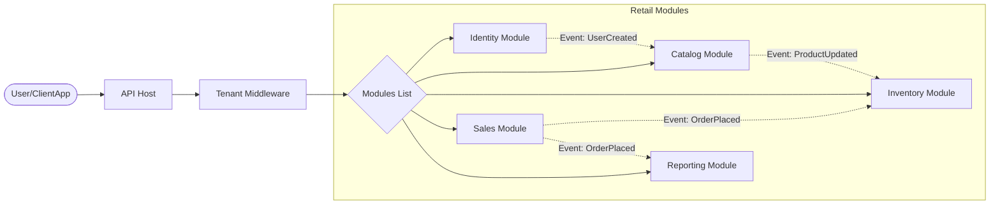
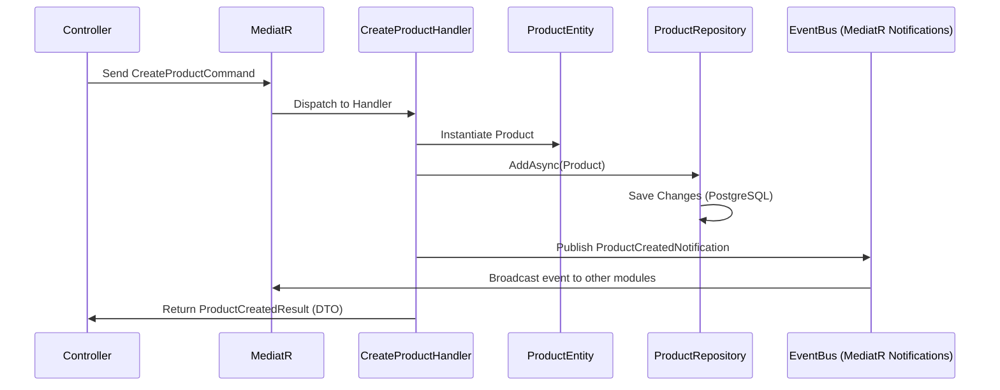
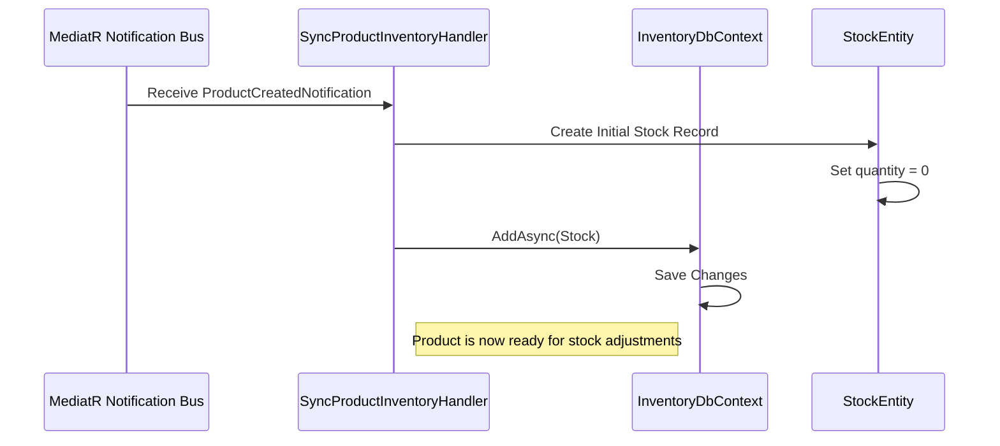
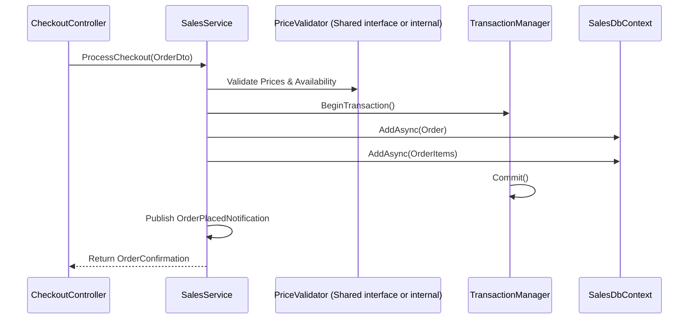

# Module Designs: Retail POS (HLD & LLD)

## 1. High-Level Design (HLD)
### Global System Flow (Module Interactions)

---

## 2. Low-Level Designs (LLD) by Module

### 2.1 Catalog Module LLD
**Internal Flow:**

---

### 2.2 Inventory Module LLD
**Internal Flow (Handling Product Updates):**

---

### 2.3 Sales Module LLD
**Internal Flow (Transaction Management):**

---

## 3. Technology Alignment
Each module is implemented as a standalone .NET 9 project following the "Vertical Slice" pattern. This ensures that a bug in the `Catalog` module doesn't bring down the `Sales` module if they were deployed as independent services later.
